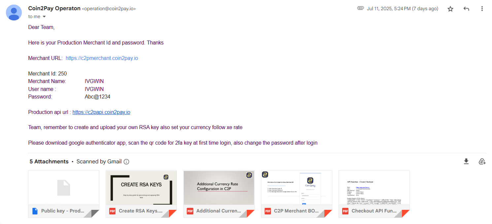
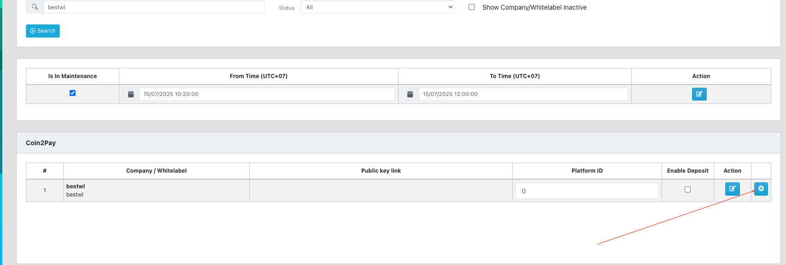
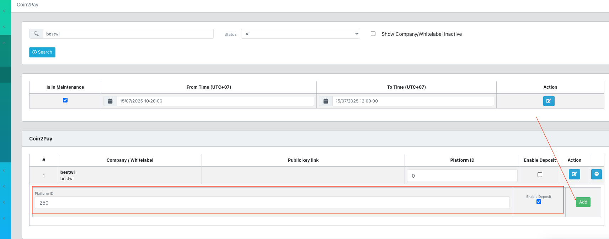
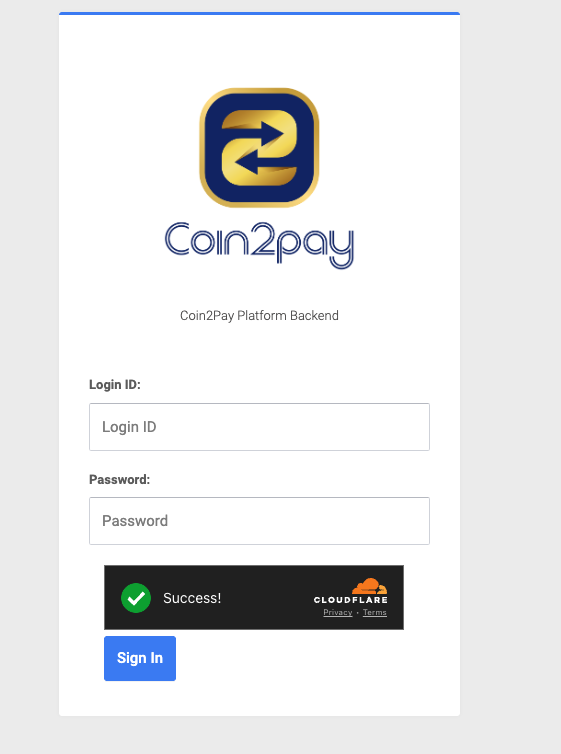
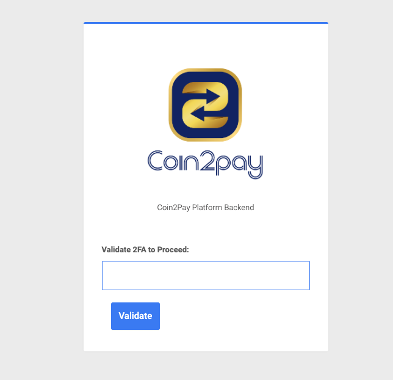
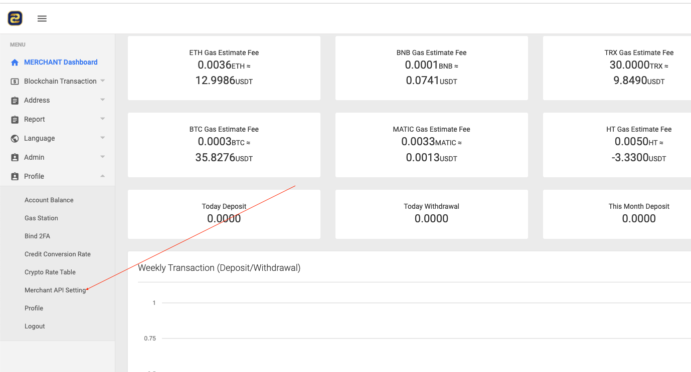
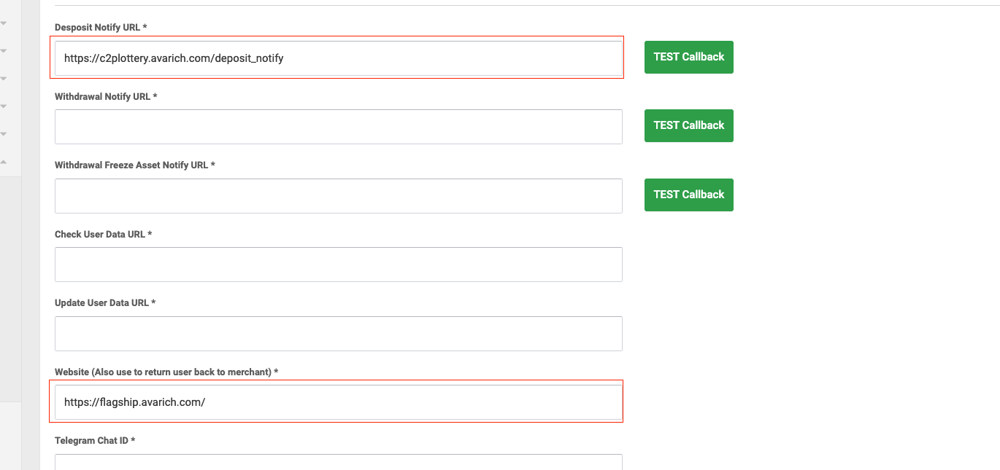
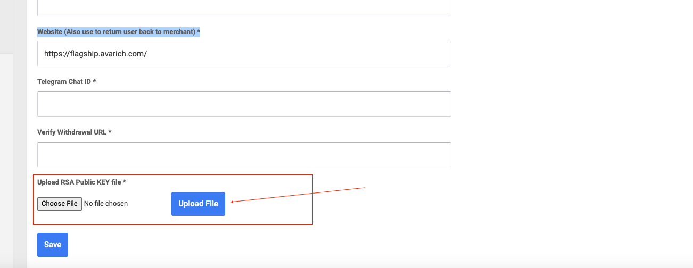
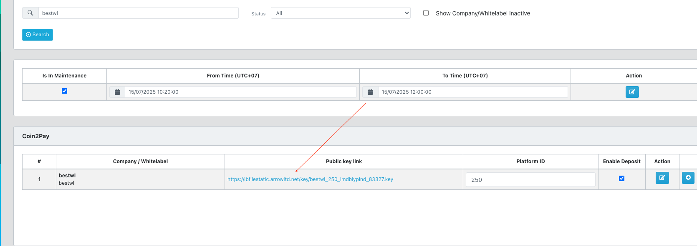
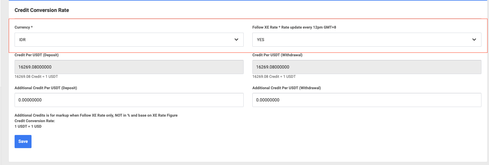

# Coin2pay Configuration Step

The following steps outline how Vigor can enable Coin2Pay integration upon an agent’s request.

## **I. Register Coin2Pay**

Vigor will contact Coin2Pay to register a new agent using the form below:

1. **Personal in-charge name:** The person directly working with Coin2Pay to request info for the agent.
2. **Personal in-charge email:** The email address used to receive registration confirmation.
3. **Personal in-charge contact number:** Phone number of the person coordinating with Coin2Pay during registration.
4. **Portal link (website URL):** The website of the agent requesting Coin2Pay.
5. **Merchant name:** Agent name.
6. **End Point IP:** `52.221.71.64`
    *(Use the production IP of the engine. Currently used for lottery only, so keep it as is)*
    Callback URL for lottery:
    `http://c2plottery.superhoki.vip/deposit_notify` *(keep this if the request is for lottery)*
7. **Currency:** IDR *(currently fixed as IDR)*
8. **Gas fee bear by Merchant:** Optional, depending on the requesting party.
    For example, in IVGWIN’s case, the merchant bears the fee.

**Example:**

- Personal in-charge name: Hyung
- Personal in-charge email: support@arrowltd.net
- Personal in-charge contact number: +85592760739
- Portal link (website URL): https://18.140.74.87/
- Merchant name: IVGWIN
- End Point IP: 52.221.71.64
   Callback URL: http://c2plottery.superhoki.vip/deposit_notify
- Currency: IDR
- Gas fee: Borne by Merchant

------

## **II. Coin2Pay Sends Mail**

After registration, Coin2Pay will send an email containing necessary credentials and URLs.

------

## **III. Configure in Vigor BO**

- Log in to **Vigor BO** using admin/adminsub

- Navigate to **Tools → Coin2Pay**

- Click **Add**

  

- In the **platformID** field, enter the **Merchant ID** provided in the Coin2Pay email, then click **Add**

  

- The system will generate a **public key link** for the agent. Click the link to download the public key.

  

- This completes the setup on Vigor.

------

## **IV. Configure in Coin2Pay BO**

### **1. Login**

- Use the login URL provided in the Coin2Pay email (e.g.,
   `Merchant URL: https://c2pmerchant.coin2pay.io`)

  

- Enter the **Login ID** and **Password** (included in the email)
   Example:

  - Username: IVGWIN
  - Password: Abc@1234

- Click **Login**. The system will redirect to a **Validation** page.

  

  - On first login, a QR code will appear.
  - Use **Google Authenticator** app to scan and get a 6-digit code.
  - Enter the code and click **Validate**.

### **2. Merchant API Setting**

- After logging in, go to **Profile → Merchant API Setting**

  

- Fill in the following fields:

  

  - **Deposit Notify URL:** Use the value from step **I** (Register Coin2Pay), field 6
     (e.g., `http://c2plottery.superhoki.vip/deposit_notify`)

  - **Website (Also use to return user back to merchant):** Use the agent’s website from step **I**, field 4.

  - **Important:** **Upload RSA Public KEY file*:**

    - Click **Choose File**

      

    - Select the public key file downloaded from **Vigor BO** (step **III**: Tools → Coin2Pay)

      

    - Click **Upload File**

  - Click **Save** to complete.

### **3. Configure Credit Rate**

- After logging in successfully, go to **Profile → Credit Conversion Rate**

  

- Set:

  - **Currency:** **IDR**
  - **Follow XE Rate / Update every 12pm GMT+8:** **Yes**

- Click **Save**

Process completed